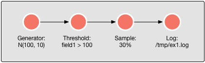
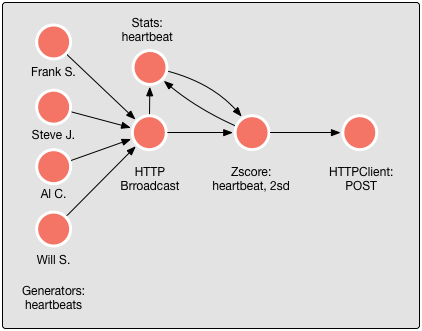
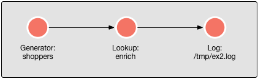
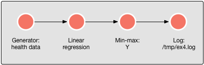

<!--
   Licensed to the Apache Software Foundation (ASF) under one or more
   contributor license agreements.  See the NOTICE file distributed with
   this work for additional information regarding copyright ownership.
   The ASF licenses this file to You under the Apache License, Version 2.0
   (the "License"); you may not use this file except in compliance with
   the License.  You may obtain a copy of the License at

       http://www.apache.org/licenses/LICENSE-2.0

   Unless required by applicable law or agreed to in writing, software
   distributed under the License is distributed on an "AS IS" BASIS,
   WITHOUT WARRANTIES OR CONDITIONS OF ANY KIND, either express or implied.
   See the License for the specific language governing permissions and
   limitations under the License.
-->

## Examples

We have prepared some examples with the currently available actors to give you some inspiration.

- [Example1](#example1)
- [Example2](#example2)
- [Example3](#example3)
- [Example4](#example4)

### Example 1

This example generates data 10 times per second according to a normal distribution, filters out everything above the mean, samples 30% from this and writes the result to "/tmp/ex1.log".

 

 

The JSON looks as follows:


{
  "name": "runtime1",
  "actors": [{
    "name": "generator1",
    "type": "generator",
    "params": {
      "format": {
        "field1": "N(100, 10)"
      }, "timer": {
        "rate": 10
      }
    }
  }, {
    "name": "threshold1", 
    "type": "threshold",
    "params": {
      "key": "field1",
      "threshold": 100
    }
  }, {
    "name": "sample1",
    "type": "sample",
    "params": {
      "fraction": 0.30
    }
  }, {
    "name": "log1",
    "type": "log",
    "params": {
      "file": "/tmp/ex1.log"
    }
  }], "links": [
    { "from": "generator1", "to": "threshold1" },
    { "from": "threshold1", "to": "sample1" },
    { "from": "sample1", "to": "log1" }
  ]
}


--------------------------

### Example 2 

This example generates heartbeats of four people living in four different cities: Frank S. in New York, Steve J. in San Fransisco, Al C. in Chicago and Will S. in Miami. Since all of these persons have an exiting life, they want to be notified when their heart rate exceeds their average rate with twice the standard deviation.
They have all recommended to use the Coral platform for this use case.

 

 

The JSON looks as follows. Note: This example will actually not work because the endpoints do not exist and the [HTTPClientActor](Actors-HttpClientActor) expects a HTTP status code back. But nevertheless, if the endpoints would exist, it would work.


{
  "name": "runtime1",
  "actors": [{
    "name": "generator1",
    "type": "generator",
    "params": {
      "format": {
        "name": "Frank S.",
        "city": "New York",
        "url": "http://www.sinatra.com/my-health",
        "heartbeat": "N(60, 20)"
      }, "timer": {
        "rate": 10
      }
    }
  }, {
    "name": "generator2", 
    "type": "generator",
    "params": {
      "format": {
        "name": "Steve J.",
        "city": "San Francisco",
        "url": "http://www.apple.com/heartbeat/listener-service",
        "heartbeat": "N(90, 20)"
      }, "timer": {
        "rate": 10
      }
    }
  }, {
    "name": "generator3",
    "type": "generator",
    "params": {
      "format": {
        "name": "Al C.",
        "city": "Chicago",
        "url": "http://www.mobsterweb.com/capone/health",
        "heartbeat": "N(65, 15)"
      }, "timer": {
        "rate": 10
      }
    }
  }, {
    "name": "generator4",
    "type": "generator",
    "params": {
      "format": {
        "name": "Will S.",
        "city": "Miami",
        "url": "https://twitter.com/willsmith/healthmonitor",
        "heartbeat": "N(50, 10)"
      }, "timer": {
        "rate": 10
      }
    }
  }, {
    "name": "broadcast1",
    "type": "httpbroadcast"
  }, {
    "name": "stats1",
    "type": "stats",
    "params": {
      "field": "heartbeat"
    }, "groupby": "name"
  }, {
    "name": "zscore1",
    "type": "zscore", 
    "params": {
      "field": "heartbeat",
      "score": 2.0
    }
  }, {
    "name": "httpclient1",
    "type": "httpclient", 
    "params": {
      "mode": "dynamic",
      "response": "emit",
      "field": "url",
      "method": "POST" 
    }
  }], "links": [
    { "from": "generator1", "to": "broadcast1" },
    { "from": "generator2", "to": "broadcast1" },
    { "from": "generator3", "to": "broadcast1" },
    { "from": "generator4", "to": "broadcast1" },
    { "from": "broadcast1", "to": "stats1" },
    { "from": "broadcast1", "to": "zscore1" },
    { "from": "zscore1", "to": "httpclient1" }
  ]
}


--------------------------

### Example 3

This example enriches data of shoppers with the coordinates of the cities they shop in.

 

 


{
  "name": "runtime1",
  "actors": [{
    "name": "generator1",
    "type": "generator",
    "params": {
      "format": {
        "city": "['Amsterdam', 'Berlin', 'Paris', 'London']",
        "spent": "N(100, 10)"
      }, "timer": {
        "rate": 10000
      }
    }
  }, {
    "name": "lookup1",
    "type": "lookup",
    "params": {
      "key": "city",
      "function": "enrich",
      "match": "exact",
      "lookup": {
        "Amsterdam": { "coordinates": "52°22′N 4°54′E" },
        "Berlin": { "coordinates": "52°31′N 13°23′E" },
        "Paris": { "coordinates": "48°51′24″N 2°21′03″E" },
        "London": { "coordinates": "51°30′26″N 0°7′39″W" }
      }
    }
  }, {
    "name": "log1",
    "type": "log",
    "params": {
      "file": "/tmp/ex3.log"
    }
  }], "links": [
    { "from": "generator1", "to": "lookup1" },
    { "from": "lookup1", "to": "log1" }
  ]
}


--------------------------

### Example 4

Since everybody is so focused on their health nowadays, with Coral it is possible to calculate your life expectancy with sub-millisecond performance using a regression model. 

Let's assume the regression model returns your life expectancy in years, and has the following parameters as input: 

- Y: life expectancy in years
- W: weight in kilos  
- C: number of cigarettes per day
- H: number of heart attacks in life until now
- E: amount of exercise per day in minutes

Y = 80 - 0.07W - 0.5C - 5.0H + 0.4E

As the model shows, overweight, smoking and heart attacks are all bad for you and excercise is good for you.
Your doctor has been telling you this for years! Since the result of the model is unbounded, a min-max actor has been added to cap the result to the 50-100 range.

 

 


{
  "name": "runtime1",
  "actors": [{
    "name": "generator1",
    "type": "generator",
    "params": {
      "format": {
        "W": "N(80, 20)",
        "C": "N(20, 5)",
        "H": "U(5)",
        "E": "N(20, 10)"
      }, "timer": {
        "rate": 1000
      }
    }
  }, {
    "name": "regression1",
    "type": "linearregression",
    "params": {
      "outcome": "Y",
      "intercept": 80,
      "weights": {
        "W": -0.07,
        "C": -0.5,
        "H": -5.0,
        "E":  0.4
      }
    }
  }, {
    "name": "minmax1",
    "type": "minmax",
    "params": {
      "min": 50,
      "max": 100,
      "field": "Y"
    } 
  }, {
    "name": "log1",
    "type": "log",
    "params": {
      "file": "/tmp/ex4.log"
    }
  }], "links": [
    { "from": "generator1", "to": "regression1" },
    { "from": "regression1", "to": "minmax1" },
    { "from": "minmax1", "to": "log1" }
  ]
}
