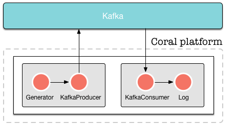

<!--
   Licensed to the Apache Software Foundation (ASF) under one or more
   contributor license agreements.  See the NOTICE file distributed with
   this work for additional information regarding copyright ownership.
   The ASF licenses this file to You under the Apache License, Version 2.0
   (the "License"); you may not use this file except in compliance with
   the License.  You may obtain a copy of the License at

       http://www.apache.org/licenses/LICENSE-2.0

   Unless required by applicable law or agreed to in writing, software
   distributed under the License is distributed on an "AS IS" BASIS,
   WITHOUT WARRANTIES OR CONDITIONS OF ANY KIND, either express or implied.
   See the License for the specific language governing permissions and
   limitations under the License.
-->

## Hello World with Kafka

  - [Introduction](#introduction)
  - [Kafka](#kafka)
  - [Start the platform](#startplatform)
  - [Set up the first runtime](#setupfirstruntime)
  - [Start the first runtime](#startfirstruntime)
  - [Create the second runtime](#setupsecondruntime)
  - [Start the second runtime](#startsecondruntime)
  - [Investigate the output](#investigateoutput)
  
 

### Introduction

This is a complete example how to start the platform, create a pipeline that writes data to Kafka, create another pipeline that reads data from Kafka and writes text to a file. 

  
  Note
  <strong>NOTE</strong>: For an easier introductory example of setting up a Coral pipeline, look <a href="GettingStarted-HelloWorld.html">here</a>.

In this tutorial, we will create the following setup:

 

--------------------------

### Kafka

We put data on Kafka ourselves so we can read from it in the second pipeline. Obviously, this example is a bit contrived, but it demonstrates how to read and write from Kafka in the format we need.

As before, we assume that you have downloaded and extracted the Coral platform on your machine, and that Cassandra is running. In this tutorial, we assume that you use the latest version of the Coral platform. We will also assume that you use `curl` to send commands to Coral. As stated in the section [Prerequisites](GettingStarted-Prerequisites.html), however, you can use any HTTP client you want.

To get Kafka running on your machine, download it [here](http://kafka.apache.org/downloads.html). 
Download the latest version in .tar.gz format and extract it into a folder on your machine. 
Assuming you have downloaded version 0.9.0.0, execute the following commands:



tar -xzf kafka_2.11-0.9.0.0.tgz
cd kafka_2.11-0.9.0.0
bin/zookeeper-server-start.sh config/zookeeper.properties
bin/kafka-server-start.sh config/server.properties
bin/kafka-topics.sh --create --zookeeper localhost:2181 --replication-factor 1 --partitions 1 --topic test



We now have a Kafka topic "test" running which can be written to at localhost:2181.

We will assume that you have created a user "neo" as in the previous "Hello, world" example.

--------------------------

### Start the platform

To start the platform, enter the following command:


java -cp "coral-runtime-0.0.131.jar" \
    io.coral.api.Boot start \
    -ai "0.0.0.0" -p 8000 -ah "127.0.0.1" \
    -ap 2551 -am "coral" -ccp "192.168.100.101" \
    -cp 9042 -k "coral" -nc -ll INFO


 
To test whether the platform runs correctly, issue the following command: 


curl -H "Content-Type: application/json" \
    -H "Accept: application/json" \
    --request GET \
    --user neo:thematrix \
    http://127.0.0.1:8000/api/runtimes


The platform will respond with


[]


This is a JSON array showing the runtimes currently running on the platform. As there are no runtimes on the platform yet, it returns an empty array.

--------------------------

### Set up the first runtime

We will set up a runtime with a [generator actor](Actors-GeneratorActor.html) and a [kafka producer actor](Actors-KafkaProducerActor.html) that writes the generated data to file. The definition of the runtime is as follows:


{
  "name": "runtime1",
  "projectid": "",
    "actors": [{
      "name": "generator1",
      "type": "generator",
      "params": {
        "format": {
          "field1": "Hello, world!"
        }, "timer": {
          "rate": 10
        }
      }
    }, {
      "name": "kafkaproducer1",
      "type": "kafka-producer",
      "params": {
        "topic": "test",
        "kafka": {
          "metadata.broker.list": "localhost:9092"
        }
      }
    }], "links": [
      { "from": "generator1", "to": "kafkaproducer1" }
    ]
}


This is the first part of the pipeline that generates data and sends it to Kafka. This runtime generates the text "Hello, world!" 10 times per second and writes the output to the Kafka topic "test" until it is stopped.

To create the runtime, send the following command:


curl -H "Content-Type: application/json" \
    -H "Accept: application/json" \
    --user neo:thematrix \
    --request POST  \
    --data '{ "name": "runtime1", "owner": "neo", "actors": [{ "name": "generator1", "type": "generator", "params": { "format": { "field1": "Hello, world!" }, "timer": { "rate": 10 }}}, { "name": "log1", "type": "log", "params": { "file": "/tmp/runtime1.log" }}], "links": [ { "from": "generator1", "to": "log1" }]}' \
http://127.0.0.1:8000/api/runtimes


The platform responds by returning the following information: 


{
  "success": true,
  "created": "2015-12-25T12:06:45.731",
  "id": "20acd9ca-2532-433d-9be2-83608f7f2686",
  "definition": {
    "name": "runtime1",
    "owner": "fb7ee9d5-2ee1-4c63-9a95-2edb7f4f7c04",
    "projectid": "",
    "actors": [{
      "name": "generator1",
      "type": "generator",
      "params": {
        "format": {
          "field1": "Hello, world!"
        }, "timer": {
          "rate": 10
        }
      }
    }, {
      "name": "log1",
      "type": "log",
        "params": {
          "file": "/tmp/runtime1.log"
        }
      }
    ], "links": [{
      "from": "generator1", "to": "log1"
    }]
  }
}


The UUID's and the created time in your response may vary from the ones shown here.
The runtime has now been created.

--------------------------

### Start the first runtime

The runtime is now created but is not started yet. To start the runtime, issue a PATCH commmand as follows: 


curl -H "Content-Type: application/json" \
    -H "Accept: application/json" \
    --user neo:thematrix \
    --request PATCH \
    --data '{ "status": "start" }' \
    http://127.0.0.1:8000/api/runtimes/runtime1


The platform responds with: 


{
    "action": "Start runtime",
    "name": "runtime1",
    "owner": "neo",
    "success": true,
    "time": "2015-12-29T16:21:58.752"
}


The start time in your response may vary from the one shown here. The runtime is now started and will generate a "Hello, World!" every second. You can check with the following command that the data actually arrives in Kafka (this command should be executed in the Kafka directory):


bin/kafka-console-consumer.sh --zookeeper localhost:2181 --topic test --from-beginning


--------------------------

### Create the second runtime

To listen to the Kafka events that we are generating, we create a second runtime.
To do this, we are going to create another runtime with the following definition:


{
  "name": "runtime2",
  "projectid": "",
    "actors": [{
      "name": "kafkaconsumer1",
      "type": "kafka-consumer",
      "params": {
        "topic": "test",
        "kafka": {
          "zookeeper.connect": "localhost:2181",
          "group.id": "runtime2"
        }
      }
    }, {
      "name": "log1",
      "type": "log",
      "params": {
        "file": "/tmp/runtime2.log"
      }
    }], "links": [
      { "from": "kafkaconsumer1", "to": "log1" }
    ]
}


To create this second runtime, issue the following command:


curl -H "Content-Type: application/json" \
	-H "Accept: application/json" \
	--user neo:thematrix \
	--request POST \
	--data '{ "name": "runtime2", "owner": "neo", "actors": [{ "name": "kafkaconsumer1", "type": "kafka-consumer", "params": { "topic": "test", "kafka": { "zookeeper.connect": "localhost:2181", "group.id": "runtime2" }}}, { "name": "log1", "type": "log", "params": { "file": "/tmp/runtime2.log" }}], "links": [{ "from": "kafkaconsumer1", "to": "log1" }]}' \
http://127.0.0.1:8000/api/runtimes


--------------------------

### Start the second runtime

To start the second runtime, issue the following command:


curl -H "Content-Type: application/json" \
    -H "Accept: application/json" \
    --user neo:thematrix \
    --request PATCH \
    --data '{ "status": "start" }' \
    http://127.0.0.1:8000/api/runtimes/runtime1


--------------------------

### Investigate the output

The file "/tmp/runtime2.log" should not contain the following:


{ "field1": "Hello, World!" }
{ "field1": "Hello, World!" }
{ "field1": "Hello, World!" }
{ "field1": "Hello, World!" }
{ "field1": "Hello, World!" }
{ "field1": "Hello, World!" }
...


And that's it! Our "Hello, world" example using Kafka.
