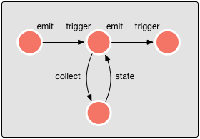

<!--
   Licensed to the Apache Software Foundation (ASF) under one or more
   contributor license agreements.  See the NOTICE file distributed with
   this work for additional information regarding copyright ownership.
   The ASF licenses this file to You under the Apache License, Version 2.0
   (the "License"); you may not use this file except in compliance with
   the License.  You may obtain a copy of the License at

       http://www.apache.org/licenses/LICENSE-2.0

   Unless required by applicable law or agreed to in writing, software
   distributed under the License is distributed on an "AS IS" BASIS,
   WITHOUT WARRANTIES OR CONDITIONS OF ANY KIND, either express or implied.
   See the License for the specific language governing permissions and
   limitations under the License.
-->

## Actor Overview

- [Anatomy of a Coral Actor](#anatomy)
  - [Relationship with Akka Actors](#relationship)
- [Predefined Actors](#predefined)
- [Creating a Coral Actor](#creating)
  - [Example](#example)
- [Using your own Coral Actors](#usingyourown)

 

### Anatomy of a Coral Actor

A Coral Actor ([source](https://github.com/coral-streaming/coral/blob/master/runtime-api/src/main/scala/io/coral/actors/CoralActor.scala)) extends the [Akka Actor](http://doc.akka.io/docs/akka/snapshot/scala/actors.html) class. It provides additional functionality to handle JSON messages and dynamic routing of these messages.

A Coral actor is an Akka Actor that listens specifically for JSON messages, executes its *trigger* procedure when it receives a JSON message, and sends the result to its *emit* targets when finished. The emit targets are set in the configuration of a new [Coral runtime](API-POST-runtime.html).

 

 

Furthermore, A Coral Actor can also *collect* additional information that it needs from other Coral Actors and expose *state* variables that can be collected by other Coral Actors.

The *state* of an actor are the variables that an actor chooses to expose. Not all variables within an actor are state variables; a Coral Actor has to specifically add internal variables to its state map to expose it. A JSON object with a read-only copy of the variable is created on a collect request. 

For example, when an actor chooses to expose `var avg: Double` to the outside world, a collect on the state of that actor will look as follows:


{
   "avg": 5.2
}


 

#### Relationship with Akka Actors

This all looks very similar to plain Akka Actors, but Coral Actors can be dynamically wired to run in any desired configuration. This is the power of the Coral platform: since the interface from and to Coral Actors is always identical (JSON objects), it is possible to connect any Coral Actor to any other, without knowing what information they will share between them.

Of course, in plain Akka Actors, it is also possible to send objects with type `Any` to and from actors, but the Coral platform provides additional functionality that ensures that all Coral actors run smoothly and behave in the same way. The Coral platform also provides resiliency to each Coral Actor by default. Additionally, Coral creates an endpoint for each Coral actor on which statistics can be obtained and JSON objects can be inserted.

Messages other than JSON objects will be ignored by Coral Actors, unless it is a system message on which a Coral Actor is programmed to respond. This behavior is part of the platform and cannot be changed by end users.

--------------------------

### Predefined Actors

There are several predefined actors present that can be created on the Coral platform:

type             | class | description
:----------------| :---- | :----------
`cassandra`      | [CassandraActor](/coral/docs/Actors-CassandraActor.html) | connect to a Cassandra database
`fsm`            | [FsmActor](/coral/docs/Actors-FsmActor.html) | select a state according to key
`generator`      | [GeneratorActor](/coral/docs/Actors-GeneratorActor.html) | generate data based on a JSON template and distribution definitions
`group`          | [GroupByActor](/coral/docs/Actors-GroupByActor.html) | partition the stream
`httpbroadcast`  | [HttpBroadcastActor](/coral/docs/Actors-HttpBroadcastActor.html) | pass (HTTP supplied) JSON to other actors
`httpclient`     | [HttpClientActor](/coral/docs/Actors-HttpClientActor.html) | post to a service URL
`json`           | [JsonActor](/coral/docs/Actors-JsonActor.html) | transform an input JSON
`kafka-consumer` | [KafkaConsumerActor](/coral/docs/Actors-KafkaConsumerActor.html) | reads data from Kafka
`kafka-producer` | [KafkaProducerActor](/coral/docs/Actors-KafkaProducerActor.html) | writes data to Kafka
`log`            | [LogActor](/coral/docs/Actors-LogActor.html) | logs data to a file
`linearregression`| [LinearRegressionActor](/coral/docs/Actors-LinearRegressionActor.html) | performs prediction on streaming data
`lookup`         | [LookupActor](/coral/docs/Actors-LookupActor.html) | find data for a key value
`sample`         | [SampleActor](/coral/docs/Actors-SampleActor.html) | emits only a fraction of the supplied trigger JSON
`stats`          | [StatsActor](/coral/docs/Actors-StatsActor.html) | accumulate some basic statistics
`threshold`      | [ThresholdActor](/coral/docs/Actors-ThresholdActor.html) | emit only when a specified field value exceeds a threshold
`window`         | [WindowActor](/coral/docs/Actors-WindowActor.html) | collect input objects and emit only when reaching a certain number or a certain time
`zscore`         | [ZscoreActor](/coral/docs/Actors-ZscoreActor.html) | determine if a value is an outlier according to the Z-score statistic

--------------------------

### Creating a Coral actor

A Coral actor is created when a new runtime JSON is posted to /api/runtimes.
An actor always contains at least a `type` field, which is a String that is present in the "type" column in the table above.

The attributes in the constructor JSON of the Coral actor contain the following fields:

field     | type     | required | description
:-------- | :------- | :------- | :------------
`type`    | string   | yes | the name of the actor
`params`  | json     | yes | parameters of the actor

 

#### Example

The following pipeline creates two actors, one *generator* actor that generates data according to a specified distribution, and one *log* actor that writes its input to a text file.


{
  "name": "runtime1",
  "actors": [{
    "name": "generator1",
    "type": "generator",
    "params": {
      "format": {
        "field1": "Hello, world!"
      }, "timer": {
        "rate": 10
      }
    }
  }, {
    "name": "log1",
    "type": "log",
    "params": {
      "file": "/tmp/runtime1.log"
    }
  }], "links": [
    { "from": "generator1", "to": "log1" }
  ]
}


The [generator actor](/coral/docs/Actors-GeneratorActor.html) as it is specified here creates a new actor that outputs the text "Hello, world!" every 100 milliseconds (10 times per second). The second actor is a [log actor](/coral/docs/Actors-LogActor.html) that has only one parameter: the file to which the output should be written, in this case "/tmp/runtime1.log". 

--------------------------

### Using your own Coral actors

When the provided Coral actors or a combination of them don't provide the functionality you need, you can write your own Coral actor and use it. You can write your own Scala or Java library that contains the definition of the actor. For this, you need to create a class that extends the [`ActorPropFactory`](https://github.com/coral-streaming/coral/blob/master/runtime-api/src/main/scala/io/coral/actors/ActorPropFactory.scala) trait.
See for an example the [`DefaultActorPropFactory`](https://github.com/coral-streaming/coral/blob/master/runtime-api/src/main/scala/io/coral/actors/DefaultActorPropFactory.scala) class, which contains all the provided Coral actors.

Next, you create a jar with your Coral actor(s) and your factory and add this jar to the classpath. To configure the Coral platform to use your factory, add the following to your *application.conf* file:


injections {
    actorPropFactories = ["mypackage.MyFactory"]
}


You can define more than one factory. When looking for a Coral actor by name, the search order is the order in which the factories are given. Before searching in user defined factories, the default factory with the provided Coral actors is searched for a given Coral actor name, so it is not possible to redefine one of the provided actors.