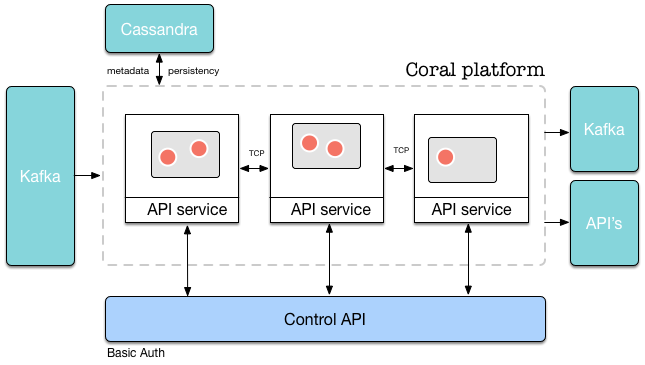

<!--
   Licensed to the Apache Software Foundation (ASF) under one or more
   contributor license agreements.  See the NOTICE file distributed with
   this work for additional information regarding copyright ownership.
   The ASF licenses this file to You under the Apache License, Version 2.0
   (the "License"); you may not use this file except in compliance with
   the License.  You may obtain a copy of the License at

       http://www.apache.org/licenses/LICENSE-2.0

   Unless required by applicable law or agreed to in writing, software
   distributed under the License is distributed on an "AS IS" BASIS,
   WITHOUT WARRANTIES OR CONDITIONS OF ANY KIND, either express or implied.
   See the License for the specific language governing permissions and
   limitations under the License.
-->

## Architecture

  - [Global overview](#global)
  - [Design principles](#principles)
  - [API-driven design](#apidriven)
    - [API overview](#apioverview)
  - [Runtime actors and helper actors](#actors)
  - [Actor and node communication](#communication)
  - [Security](#security)
    - [Permissions](#permissions)
  - [Boot program](#boot)
  - [Cluster distribution](#distribution)
  
 

### Global overview

Coral is a platform that enables real-time, streaming/event-driven analytics. In short, Coral transforms events coming from an event bus (at this time only Kafka) into other events which can be sent to Kafka or other API's. 

On Coral, users define *runtimes*. A *runtime* is a single configuration which is created by a user and performs a specific transformation to the input data. Multiple *runtimes* can run at the same time on the platform. Each of these runtimes processes events according to its runtime definition which was provided in the JSON constructor of the runtime. A typical runtime consists of multiple different *actors* which each perform a single task on the events that are sent to it, and outputs a transformed event when triggered.

A global overview of the architecture of Coral is shown in the picture below.

The Coral platform consists of multiple machines/nodes (black boxes with "API Service" attached). On each node, multiple runtimes can run (grey boxes), in which actors run (red boxes with white border). Each node is essentially a container to serve the runtimes running on it. On a single machine, multiple runtimes with multiple actors can run at the same time. Each node can be accessed by the Coral API. The API and the results of API calls are consistent across the whole cluster, no matter which node is accessed.

Each node in the cluster is identical, and is started by the exact same program as any other. In spirit of a true distributed system, there are no "master" or "head" nodes. 

--------------------------

### Design principles

Coral is a *reactive* system, meaning that it fulfills these four requirements (taken from the [Reactive Manifesto](http://www.reactivemanifesto.org)):

- **Responsiveness**  
Requests are handled in a couple of milliseconds. Of course, the exact time depends on the specific request.
- **Resiliency**  
The system is designed for failure and can restore after a crash.
- **Elasticity**  
What we call linear scalability: the system stays responsive under varying workload. New nodes can simply be added when current resources are inadequate to handle the load.
- **Message driven**  
The system does not do much at all unless you ask it to. In that sense, it is pretty lazy!

When building Coral, we have adapted the following set of guiding principles:

- **Configuration over coding**  
We have assumed that the typical end user is less likely to be familiar with [Scala](http://www.scala-lang.org) and fuctional programming than us. We have therefore aimed to make the platform fully configurable not by programming but by configuration through its RESTful interface.
- **Resiliency**  
We have aimed to design the system for failure. When a failure occurs on the level of a single actor, a single pipeline or a single machine, a new actor can be restarted, the pipeline can be restored or another
machine can take over the operation of the failed one. To achieve this, all events that come in are first persisted to disk and then executed (event-sourcing). When an actor crashes, it can replay all events in the event source to restore its state up to the moment it crashed. Other actors are completely stateless and therefore do not need to persist anything.
- **Linear scalability**  
Thanks to [Akka](http://www.akka.io), [Cassandra](http://cassandra.apache.org) and [Kafka](http://kafka.apache.org), which are all distributed, linearly scalable systems, Coral is linearly scalable as well. Each node is identical to any other, and new nodes can be added to the system through the RESTful interface.
- **Security**  
Coral uses Basic Authentication to authenticate users. Each individual API call must be executed with a Basic Authentication header. Depending on the authentication mode chosen (see [Security](#security)), the user name and password will be checked against a stored value. If authenticated, an authorization check will be performed on the combination of the used method (GET, POST, etc), URL and user.
- **Millisecond-range response times**  
Thanks to the use of [Spray](http://www.spray.io) and the Akka actor framework, most requests can be handled within milliseconds. Of course, this depends on the specific task that needs to be executed.
- **Functional programming**  
By applying functional programming techniques, we hope to reduce the number of bugs in code. Most of the code is completely stateless, except for variables inside of actors. Thus far, it has worked out pretty well!

The architecture and design of Coral reflect these principles.

--------------------------

### API-driven design

The design of the Coral platform is to a large extent driven by the design of the API it serves.
Each request more or less follows the same steps: 

1. An HTTP request comes in on a node.
2. Authorization and authentication of the request are performed.
3. If step 2 succeeds, the proper entity belonging to the request is fetched. For instance, if the request asks to start a certain runtime, the runtime object belonging to the request is obtained.
4. If step 3 succeeds, the request is forwarded to the responsible actor. For instance, if the request asks to create a new runtime, the request is forwarded to the RuntimeAdminActor. In the case of actions on runtimes, the request is forwarded to the node on which the runtime actually lives.
5. When the actor returns with its answer in JSON form, the JSON object is returned to the API caller, together with an HTTP response code reflecting the result of the operation.
6. If a change to runtimes or users was made, the authenticator actors on each node will be invalidated, who will then reload their cached tables of users and runtimes from Cassandra.

--------------------------

### API overview

The Coral platform is controlled through its RESTful API. There are several *resources* which can be controlled with the API:

- **Platform**  
The platform itself has settings and statistics which can be obtained through the /api/platform endpoint.
Platform statistics contains information about the number of machines currently in the cluster, the number of runtimes running on it, and other information.
- **Runtimes**  
Runtimes are the most important resource that can be controlled by the API. Runtimes can be created with a POST operation and started and stopped with a PATCH operation.
- **Actors**  
Interaction with individual actors that are present in runtimes is possible. This way statistics can be obtained for specific actors, or individual (debug) messages can be posted to an actor. In Coral, each actor in a runtime has its own standard endpoint.
- **Users**  
If Coral's internal authentication mechanism is used, users can be added and granted permissions to specific runtimes and API calls.
- **Permissions**  
Access to individual resources and combinations of users, verbs (POST, PATCH, etc) and endpoints can be controlled by permission objects.
- **Projects**  
Currently not present, but in the future, projects could be created in which users can design runtimes.

The full list of endpoints is given in the [API Reference](Documentation-ApiReference.html).

--------------------------

### Runtime actors and helper actors

On every node, there live two kinds of actors: runtime actors and helper actors. Runtime actors (and its children) are created when a request to create a new runtime comes in. Helper actors are always present and have one instance per node.

The following helper actors will be instantiated on each node: 

- *ClusterMonitor*  
The cluster monitor listens for cluster events, such as machines joining or leaving the cluster or machines becoming unreachable. It is also responsible for providing platform-level statistics and returning a list of machines on which a runtime can be instantiated.
- *MachineAdmin*  
The machine admin handles requests with respect to machines in the cluster, such as returning lists of machines currently in the cluster, adding machines to the cluster getting machine aliases.
- *CassandraActor*  
The cassandra actor handles communication with the Cassandra database. It receives queries and sends back the data in JSON format.
- *AuthenticatorActor*  
The authenticator performs authentication and authorization on each API call, if enabled. It contains a list of runtimes currently in memory and users currently in the system.
- *RuntimeAdminSupervisor*  
This actor is the supervisor of the RuntimeAdminActor, which it instantiates when it starts. The RuntimeAdminActor handles all requests on the level of runtimes, such as creating, starting, stopping and deleting runtimes.
- *APIServiceActor*  
This [Spray](http://www.spray.io) actor directs the HTTP requests to one of the actors above.

The Coral platform does not use [cluster singletons](http://doc.akka.io/docs/akka/snapshot/scala/cluster-singleton.html), but instead starts all helper actors on each node. This makes design and code of the system easier. It also makes sure that there is always a helper actor of a certain type present on the machine that handles a request.

--------------------------

### Actor and node communication

Coral actors communicate through JSON objects. There are a couple of reasons JSON was chosen for inter-actor communication:

- **Flexibility**  
JSON can describe any object that is required by the Coral platform.
- **Dynamic declaration**  
The advantage of JSON is that objects can be specfied and parsed at runtime. Alternatively, a case class would have to be created for each message that is sent in the Coral platform. Since the service is always running and runtimes are only declared through the API, it is not possible to define case classes in source code for each required object.
- **Serializability**  
The JSON format is completely serializable, meaning that a string representation of each JSON object can created without problems, which is then sent over a TCP connection between nodes, and which is then decoded again in a JSON object.

A Coral actor is not aware of all sources from which it receives JSON objects, nor is it aware of all targets to which the output of its calculation must be sent. This is handled by the Coral platform. The only thing an actor knows is which operation to perform when it is "triggered" by an incoming JSON object.

Nodes in the cluster communicate with each other through Akka's [Gossip](http://doc.akka.io/docs/akka/2.4.1/common/cluster.html#membership) protocol. 

Since each runtime is assigned in its completeness to a single node, excessive TCP traffic caused by messages from Kafka are prevented. The only messages that cross node boundaries are API requests which are redirected to the proper machines.

--------------------------

### Security

There are four authentication modes in Coral:

- **accept-all**  
This authentication mode does not perform any authorization or authentication but simply accepts all requests. In this mode it is not necessary to add an authentication header to HTTP requests. It is also not necessary to add a user before making API calls to the platform. In this case, an implicit user with name "coral" is assumed.
- **deny-all**  
This mode rejects all requests made to the platform.
- **coral**  
This mode assumes that the unique user name and the password are set in the HTTP header through Basic Authentication. The unique user name that is entered must be present in the user table of the system.
To add a user to the system, please see [the first tutorial](GettingStarted-HelloWorld.html). 
The system first tries to match the user name and password with a user object present in the system. If it can be found, a list of permissions is obtained belonging to this user. These permissions are used to check if a user has access or not (see [Permissions](#permissions)).
- **LDAP**  
Instead of storing the user name and password in Cassandra, LDAP can be queried instead. In the case of LDAP authentication, permissions will still be managed by Coral and stored in Cassandra.

 

#### Permissions

When an API call is executed, a list of permissions belonging to the currently logged in user is checked to find out if access is allowed based on the following combination of parameters:

- The user name
- The password
- The HTTP verb (GET, POST, DELETE, ...)
- The URL of the request
  
If a permission with these parameters and a value of "allowed" exists, access is granted. If a permission with these parameters and a value of "denied" exists, access is denied.

Furthermore, the following rules apply:

- The owner of a runtime always has access for any calls made on his own runtime unless access is specifically denied;
- All other users (non-owners) are always denied access to a specific runtime unless access is specifically granted.

When creating a runtime, the owner permission is automatically added for the user that created the runtime.
To grant additional non-owners access to the runtime, permissions must be created for these users.

See the [API reference](Documentation-ApiReference.html) for the permission endpoints which can be used to create, delete or modify permissions.

--------------------------

### Boot program

The program io.coral.api.Boot starts a new instance of the Coral platform, when providing it with the "start" option. There are a couple of steps that this program will take: 

1. Parse command line arguments
2. Combine command line arguments with configuration files to obtain the final configuration object.
3. Instantiate the helper actors described above.
4. Start the API service and start listening for HTTP requests.

From this moment, the API service listens on the port as specified in the configuration of the platform. Requests can now be sent to the platform.

Each time the Boot program is started, all helper actors are created. This means that the helper actors live on each machine on which the Boot program is started. 

It is also possible to start multiple instances of the Coral platform on the same machine. If you want to do this, make sure that the coral.api.port and coral.akka.port of the second instance point to different ports as the first instance.

--------------------------

### Cluster distribution

An API call can be made to any node in the cluster, and all nodes can answer a request. However, runtimes are instantiated on a specific node according to the distribution criterium specified in either the definition of the runtime or the configuration of the platform. The node to which the request to create a new runtime is sent then checks on which node the runtime actually needs to be instantiated and forwards the request to that node if needed.

The following options exist:

- **local**  
The runtime is instantiated on the same machine as the request was sent to. This is useful for test purposes and single-node setups.
- **predefined**  
The runtime is instantiated on the predefined machine given in the configuration.
- **round-robin**  
The runtime is instantiated on machines in the cluster on a round-robin basis. When there are two nodes in the cluster, the first runtime is instantiated on the first, the second on the second, the third again on the first, etc.
- **least-nr-runtimes**  
The runtime is instantiated on the machine with the least number of runtimes currently running on it. If there are multiple machines with the same number of runtimes on it (or 0), the machines are ordered by IP address and the first machine is taken.
- **least-nr-actors**  
The runtime is instantiated on the machine with the least number of total actors currently running on it, summed over all runtimes on that machine. If there are multiple machines with the same number of actors on it (or 0), the machines are ordered by IP address and the first machine is taken.
- **random**  
The runtime is instantiated on a random machine.

The distribution mechanism can be set in the configuration of the platform or can be provided when creating a new runtime. For more information on how to do this, see the [API Reference](Documentation-ApiReference.html).
