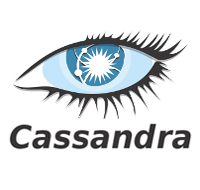
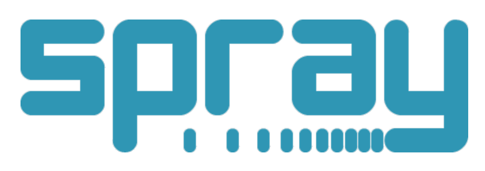

<!--
   Licensed to the Apache Software Foundation (ASF) under one or more
   contributor license agreements.  See the NOTICE file distributed with
   this work for additional information regarding copyright ownership.
   The ASF licenses this file to You under the Apache License, Version 2.0
   (the "License"); you may not use this file except in compliance with
   the License.  You may obtain a copy of the License at

       http://www.apache.org/licenses/LICENSE-2.0

   Unless required by applicable law or agreed to in writing, software
   distributed under the License is distributed on an "AS IS" BASIS,
   WITHOUT WARRANTIES OR CONDITIONS OF ANY KIND, either express or implied.
   See the License for the specific language governing permissions and
   limitations under the License.
-->

<h2>Technologies</h2>

 

Coral is built on top of the following technologies:

    

        
        
Akka is a toolkit and runtime for building highly concurrent, distributed, and resilient message-driven applications on the JVM.

        
Akka can instantiate millions of actors which can perform complex event processing within milliseconds.

    

    

    	
        
Cassandra is a distributed key-value columnar data store. It is resilient across multiple nodes, racks and data centers.

        
In Coral, Cassandra provides storage for the persistency layers for actors. It also stores meta-information of the Coral platform.

    

    

        

            
            
Scala is a programming language which combines object-oriented and functional elements. Functions are first-class citizens. Scala enables concise descriptions of functionality without being distracted by verbose syntax. In combination with Akka, it enables a clean way of working with failures, exceptions and multi-threading, all with very low code complexity.

        

        

            
            
Spray provides a small, embedded and super-fast HTTP server that is a great alternative
                to servlet containers. spray-can is fully asynchronous and can handle thousands of concurrent
                connections. It also supports request and response streaming, HTTP pipelining and SSL.
            

            
Spray is used in the Coral platform to connect service actors directly to API endpoints.
            

        

    

